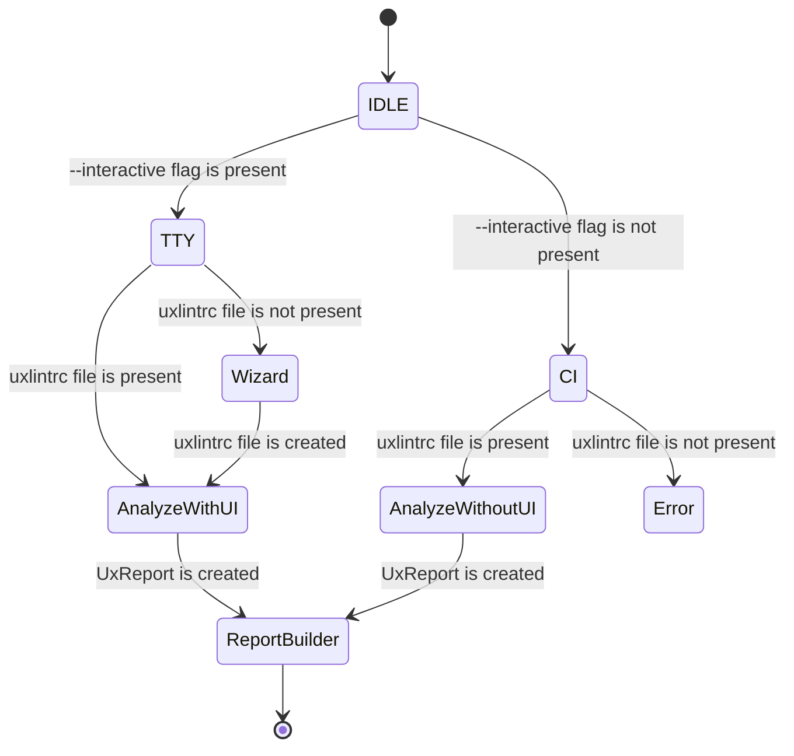

# CLAUDE.md

This file provides guidance to Claude Code (claude.ai/code) when working with code in this repository.

## Project Overview

uxlint is an AI-powered UX review CLI tool built with TypeScript and React (Ink). It analyzes web applications based on user-provided configuration files (personas, features, pages) and generates actionable UX reports.

**CRITICAL: MCP Protocol and stdout/stderr**

This application uses the MCP (Model Context Protocol) for communication. **NEVER use stdout or stderr for logging purposes** as these streams are reserved for MCP protocol messages. All logging must be done to files only. Use the Winston logger configured in `source/infrastructure/logger.ts` which writes exclusively to log files.

**Key technologies:**

- TypeScript with ES modules
- React via Ink (terminal UI framework)
- Ava for testing with tsimp for TS support
- XO for linting (with React config)
- Prettier for formatting
- Husky for git hooks
- Semantic release for versioning
- Winston for file-only logging (MCP-safe)

**Constitutional Principles** (see `.specify/memory/constitution.md` v1.2.0):
1. Code Quality Gates (compile → format → lint sequence) — NON-NEGOTIABLE
2. Test-First Development (Unit tests for models, visual regression for components, mock-based tests for LLM integrations) — NON-NEGOTIABLE
3. UX Consistency via Persona-First Design (with Ink ecosystem library discovery via GitHub MCP)
4. Performance Accountability (measurable goals)
5. Simplicity & Minimalism (justify complexity)

## Development Commands

### Building

```bash
npm run build          # Compile TypeScript to dist/
npm run dev            # Watch mode compilation
npm run compile        # Type-check without emitting files
```

### Testing

```bash
npm test              # Run full test suite (prettier, xo, ava with coverage)
npm run lint          # Run XO linter only
npm run format        # Format code with Prettier
```

**Run a single test file:**
```bash
npm test tests/test.spec.tsx
```

**Run tests in watch mode:**
```bash
npm run test --watch
```

### Required After Code Changes (Constitution I: Code Quality Gates)

**NON-NEGOTIABLE:** After modifying or creating any code, you MUST run these commands in this exact sequence:

```bash
npm run compile       # Type-check the code (zero errors required)
npm run format        # Format code with Prettier (applied consistently)
npm run lint          # Check linting rules (zero violations required)
```

**Execution Order**: compile → format → lint. Running format before lint prevents formatting-related linting violations.

These quality gates are enforced by the project constitution (v1.2.0) and prevent commits with type errors, linting violations, or formatting inconsistencies. Do not bypass linting by using `// eslint-disable-next-line` or modifying the linting rules.

### Local Testing

```bash
npm run build
node dist/cli.js
```

## Architecture

### uxlint CLI State Machine



### Source Structure

- `source/cli.tsx` - CLI entry point using meow for argument parsing; renders the Ink App component
- `source/app.tsx` - Main React component rendered by Ink for terminal UI
- `tests/*.spec.tsx` - Ava tests using ink-testing-library for component testing

### Build Output

- Compiled files go to `dist/` (TypeScript compiled to JS with type declarations)
- Entry point: `dist/cli.js` (specified in package.json `bin` field)

### Testing Architecture

**Testing Strategy** (Constitution II: Test-First Development):
- **Models** (pure TypeScript classes/functions): Unit tests using Ava
- **Components** (React/Ink UI): Visual regression tests using ink-testing-library
- **Language Model Integrations**: Mock-based tests using AI SDK test helpers (`MockLanguageModelV3` from `ai/test`)
- Tests MUST be written and approved BEFORE implementation
- Tests MUST fail initially (red phase) before implementation begins
- Coverage threshold: 80% via c8

**Technical Setup**:
- Ava configured in `ava.config.js` to use tsimp for TS/TSX support
- ink-testing-library used to render components and assert on terminal output
- c8 for coverage reporting

### Code Quality

- XO with Prettier integration
- EditorConfig enforces consistent formatting

**CRITICAL - DO NOT MODIFY THESE FILES:**

The following configuration files control the project's code quality tooling and MUST NOT be modified:
- `xo.config.js` - XO linting configuration
- `.prettierrc` - Prettier formatting configuration
- `.prettierignore` - Prettier ignore patterns

These files are carefully configured to work together. Modifying them can break the tooling integration and cause conflicts between formatters and linters. If you encounter linting or formatting issues, fix the source code to comply with the existing rules, do not modify the configuration files.

### Code Patterns

**Re-exports are PROHIBITED:**

DO NOT create wrapper functions or re-export class methods as standalone functions for "backward compatibility". This pattern:
- Creates unnecessary code duplication
- Makes the codebase harder to maintain
- Obscures the actual implementation
- Adds no value to the project

**BAD (Do NOT do this):**
```typescript
export class ConfigIO {
  findConfigFile(dir: string) { /* ... */ }
}

export const configIO = new ConfigIO();

// ❌ NEVER do this - no re-exports!
export const findConfigFile = (dir: string) => configIO.findConfigFile(dir);
```

**GOOD (Do this instead):**
```typescript
export class ConfigIO {
  findConfigFile(dir: string) { /* ... */ }
}

export const configIO = new ConfigIO();

// ✓ Use the singleton instance directly
import {configIO} from './config-io.js';
configIO.findConfigFile(process.cwd());
```

If you need to refactor from functions to classes, update all call sites to use the class directly. Do not add compatibility layers.

## Configuration Files

The CLI reads `.uxlintrc.yml` or `.uxlintrc.json` from CWD with:

- `mainPageUrl` and `subPageUrls` - URLs to analyze
- `pages[]` - Feature descriptions per URL
- `personas[]` - User persona descriptions
- `report.output` - Output path for generated report

See README.md for full schema and examples.

## Important Constraints

- **Node version:** >=18.18.0
- **Module system:** ES modules only (`"type": "module"`)
- **TSConfig:** Extends `@sindresorhus/tsconfig`, outputs to `dist/`, uses React JSX transform
- **Git hooks:** Husky enforces commitlint (conventional commits)

## Release Process

Uses semantic-release configured in `.releaserc.json`. Release workflow runs on main branch pushes.

## Active Technologies
- TypeScript (ES modules) with Node.js >=18.18.0 (003-cloud-oauth2)
- OS-native secure storage (keychain on macOS, credential manager on Windows, keyring on Linux) for tokens (003-cloud-oauth2)

## Recent Changes
- 003-cloud-oauth2: Added TypeScript (ES modules) with Node.js >=18.18.0
