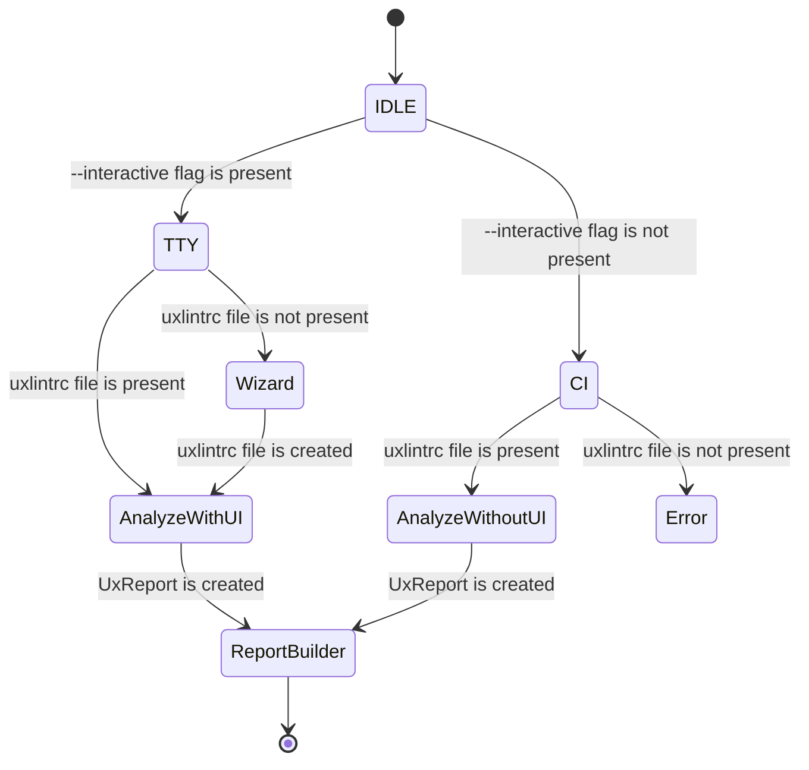

# uxlint

AI-powered UX review CLI for web apps — guided by your product personas and key features.

## Demo


## Overview

uxlint is a CLI tool that generates a UX evaluation report for a target web application using AI. It takes your configuration file as input — including the main and sub page URLs, freeform descriptions of key features on each page, and your customer personas — and outputs a persona-aware, task-oriented UX report to the path you specify.

Designed for frontend engineers who want quick, actionable UX feedback aligned with real user contexts.

## Key capabilities

- Persona-aware analysis using your provided persona descriptions
- Page-by-page evaluation guided by your freeform feature descriptions
- Actionable recommendations prioritized for frontend teams
- Single command execution with zero boilerplate beyond one config file

## Installation

```bash
npm install -g @gyeonghokim/uxlint
```

Or use directly with npx (no installation required):

```bash
npx @gyeonghokim/uxlint
```

## Environment Setup

Copy and edit the example environment file

```bash
cp .env.example .env
vim .env
```

### AI Provider Configuration

Choose one of the following providers:

- **Anthropic** (default):

  - `UXLINT_AI_PROVIDER=anthropic`
  - `UXLINT_ANTHROPIC_API_KEY`: Your Anthropic API key from https://console.anthropic.com/
  - Default model: `claude-sonnet-4-5-20250929`

- **OpenAI**:

  - `UXLINT_AI_PROVIDER=openai`
  - `UXLINT_OPENAI_API_KEY`: Your OpenAI API key from https://platform.openai.com/api-keys
  - Default model: `gpt-5`

- **Ollama** (local):

  - `UXLINT_AI_PROVIDER=ollama`
  - `UXLINT_OLLAMA_BASE_URL`: Your Ollama server URL (default: http://localhost:11434/api)
  - Default model: `qwen3-vl`
  - Requires [Ollama](https://ollama.ai/) to be installed and running locally
  - **⚠️ Important**: The model must support **both vision (multimodal) and tool calling**
    - ✅ Recommended: `qwen3-vl`, `qwen2-vl:7b`, `qwen2-vl:2b`
    - ❌ Not supported: `llama3.2-vision` (no tool calling), `llama3.1` (no vision)

- **xAI (Grok)**:

  - `UXLINT_AI_PROVIDER=xai`
  - `UXLINT_XAI_API_KEY`: Your xAI API key from https://x.ai/
  - Default model: `grok-4`

- **Google (Gemini)**:
  - `UXLINT_AI_PROVIDER=google`
  - `UXLINT_GOOGLE_API_KEY`: Your Google API key from https://ai.google.dev/
  - Default model: `gemini-2.5-pro`

**Optional Configuration:**

- `UXLINT_AI_MODEL`: AI model to use for analysis (defaults vary by provider)
- `MCP_SERVER_COMMAND`: Command to run MCP server (default: npx)
- `MCP_SERVER_ARGS`: Arguments for MCP server (default: @playwright/mcp@latest)
- `MCP_BROWSER`: Browser type for automation - chrome, firefox, webkit, msedge (default: chrome)
- `MCP_HEADLESS`: Run browser in headless mode - true/false (default: true)
- `MCP_TIMEOUT`: Operation timeout in milliseconds (default: 30000)

## Quick start

### With Example Configuration File

```bash
cp .env.example .env
```

and edit the API tokens and model names in the .env file.

```bash
cp .uxlintrc-example.json .uxlintrc.json
```

```bash
npx @gyeonghokim/uxlint --interactive
```

uxlint supports two execution modes: **Interactive mode** (with UI) and **CI mode** (headless). The behavior depends on the `--interactive` flag and whether a configuration file exists.

### Scenario 1: Interactive mode without config (Wizard)

When you run `uxlint --interactive` **without** a configuration file, the interactive wizard launches:

```bash
uxlint --interactive
# or
npx @gyeonghokim/uxlint --interactive
```

The wizard guides you through:

1. Main page URL
2. Additional pages (optional)
3. Feature descriptions for each page
4. User personas
5. Report output path
6. Option to save configuration to a file

After completing the wizard, analysis runs automatically and generates the report.

### Scenario 2: Interactive mode with config (Direct analysis)

When you run `uxlint --interactive` **with** an existing `.uxlintrc.yml` or `.uxlintrc.json` file, the wizard is skipped and analysis starts immediately:

```bash
uxlint --interactive
# or
npx @gyeonghokim/uxlint --interactive
```

The CLI reads the configuration file and runs analysis with a visual progress UI.

### Scenario 3: CI mode with config (Headless)

When you run `uxlint` **without** the `--interactive` flag **with** a configuration file, it runs in CI mode (no UI):

```bash
uxlint
# or
npx @gyeonghokim/uxlint
```

This mode is designed for CI/CD pipelines, UI is disabled.

### Scenario 4: CI mode without config (Error)

When you run `uxlint` **without** the `--interactive` flag **without** a configuration file, it exits with an error:

```bash
uxlint
# Error: Configuration file not found. Use --interactive flag to create one,
# or create .uxlintrc.yml or .uxlintrc.json in the current directory.
```

**Solution**: Use `uxlint --interactive` to create a configuration file, or manually create `.uxlintrc.yml` or `.uxlintrc.json` in your project root.

### Quick reference

| Command                | Config file exists? | Behavior                            |
| ---------------------- | ------------------- | ----------------------------------- |
| `uxlint --interactive` | ❌ No               | Launches wizard, then runs analysis |
| `uxlint --interactive` | ✅ Yes              | Skips wizard, runs analysis with UI |
| `uxlint`               | ✅ Yes              | Runs analysis in CI mode (headless) |
| `uxlint`               | ❌ No               | Shows error and exits               |

## Configuration

### Configuration file

uxlint reads one of the following files from the current working directory (CWD):

- `.uxlintrc.yml`
- `.uxlintrc.json`

**When is a config file required?**

- ✅ **CI mode** (`uxlint` without `--interactive`): Config file is **required**
- ✅ **Interactive mode** (`uxlint --interactive`): Config file is **optional**
  - If present: Wizard is skipped, analysis starts immediately
  - If absent: Wizard launches to create configuration

**Creating a config file:**

1. **Interactive wizard**: Run `uxlint --interactive` and choose to save the configuration
2. **Manual creation**: Create `.uxlintrc.yml` or `.uxlintrc.json` in your project root (see schema below)

### Schema

Required fields are marked as required. All text fields accept natural language.

- `mainPageUrl` (string, required): The primary entry URL of your app.
- `subPageUrls` (string[], required): Additional pages to analyze.
- `pages` (array, required): Per-page descriptions to guide analysis.
  - `url` (string, required): Page URL, must match one of the listed URLs.
  - `features` (string, required): Freeform description of key tasks/flows/components on the page.
- `persona` (string, required): Can be a short paragraph describing goals, motives, accessibility needs, devices, constraints, etc.
- `report` (object, required): Report output configuration.
  - `output` (string, required): File path where the report will be written (e.g., `./ux-report.md`).

### Example: YAML

```yaml
mainPageUrl: 'https://github.com'
subPageUrls:
  - 'https://github.com/login'
  - 'https://github.com/explore'
  - 'https://github.com/pricing'
  - 'https://github.com/signup'
pages:
  - url: 'https://github.com'
    features: >-
      GitHub landing page. User interactions: 1. Scroll down to view features
      section showcasing code hosting, collaboration tools, and integrations. 2.
      Click "Sign up" button located in the top right corner to navigate to
      signup page. 3. Use top navigation menu to access "Product", "Solutions",
      "Pricing", and "Enterprise" pages. 4. View trending repositories section
      showing popular open source projects. 5. Use search bar at the top to
      search for repositories, users, or topics.
  - url: 'https://github.com/login'
    features: >-
      GitHub login page. User interaction steps: 1. Locate the username or email
      input field and type your GitHub username or email address. 2. Locate the
      password input field and type your password. 3. Optionally check the
      "Remember me" checkbox to stay logged in. 4. Click the "Sign in" button to
      submit the form. If two-factor authentication is enabled, enter the 2FA
      code when prompted. After successful login, user will be redirected to
      their dashboard.
  - url: 'https://github.com/explore'
    features: >-
      GitHub Explore page showing trending repositories and topics. User
      interactions: 1. Browse trending repositories: Scroll through the list of
      trending repositories showing repository name, description, language, and
      star count. Click on any repository to view its details. 2. Explore topics:
      Click on topic tags to see repositories related to that topic. Topics are
      displayed as clickable badges. 3. Filter by language: Use the language
      filter dropdown to filter repositories by programming language (e.g.,
      JavaScript, Python, Java). 4. View collections: Scroll to see curated
      collections of repositories organized by theme or purpose. Click on a
      collection to view its contents. 5. Search: Use the search bar at the top
      to search for specific repositories, users, or topics.
  - url: 'https://github.com/pricing'
    features: >-
      GitHub pricing page displaying subscription plans. User interactions: 1.
      View pricing tiers: The page displays pricing cards for Free, Team, and
      Enterprise plans with feature comparisons. Each plan shows monthly and
      annual pricing. 2. Toggle billing period: Click the toggle switch or
      buttons to switch between monthly and annual billing. Prices update
      automatically to show discounts for annual plans. 3. Compare features: Scroll
      down to view detailed feature comparison table showing what's included in
      each plan. 4. Select a plan: Click "Get started with Team" or "Contact
      Sales" button on a pricing card to proceed with that plan. 5. View FAQ:
      Scroll down to view FAQ section about billing, plan features, and
      migration. Click on FAQ items to expand and view answers.
  - url: 'https://github.com/signup'
    features: >-
      GitHub signup page for new user registration. User interaction steps: 1.
      Enter username: Locate the username input field and type a desired
      username. The system will check availability in real-time and show
      feedback. 2. Enter email address: Locate the email input field and type an
      email address. 3. Enter password: Locate the password field and type a
      password. Observe the password strength indicator showing requirements
      (e.g., at least 8 characters, one lowercase letter, one number). 4. Email
      preferences: Optionally check/uncheck boxes for receiving product updates
      and announcements. 5. Verify account: Check the "Verify your account"
      puzzle or CAPTCHA if presented. 6. Submit form: Click "Create account"
      button to submit the registration. A verification email will be sent to
      the provided email address. Click the link in the email to verify and
      complete registration.
persona: >-
  You are a developer looking to host your open source project on GitHub. You
  want to understand how easy it is to get started, explore existing projects,
  and set up your repository. Your approach: First, visit the pricing page to
  understand what features are available in the free plan. Next, explore the
  Explore page to see what kinds of projects are popular and get inspiration.
  Then, sign up for a free account to start hosting your own projects. Finally,
  log in to access your dashboard and create your first repository.
report:
  output: './ux-report.md'
```

### Example: JSON

```json
{
	"mainPageUrl": "https://github.com",
	"subPageUrls": [
		"https://github.com/login",
		"https://github.com/explore",
		"https://github.com/pricing",
		"https://github.com/signup"
	],
	"pages": [
		{
			"url": "https://github.com",
			"features": "GitHub landing page. User interactions: 1. Scroll down to view features section showcasing code hosting, collaboration tools, and integrations. 2. Click \"Sign up\" button located in the top right corner to navigate to signup page. 3. Use top navigation menu to access \"Product\", \"Solutions\", \"Pricing\", and \"Enterprise\" pages. 4. View trending repositories section showing popular open source projects. 5. Use search bar at the top to search for repositories, users, or topics."
		},
		{
			"url": "https://github.com/login",
			"features": "GitHub login page. User interaction steps: 1. Locate the username or email input field and type your GitHub username or email address. 2. Locate the password input field and type your password. 3. Optionally check the \"Remember me\" checkbox to stay logged in. 4. Click the \"Sign in\" button to submit the form. If two-factor authentication is enabled, enter the 2FA code when prompted. After successful login, user will be redirected to their dashboard."
		},
		{
			"url": "https://github.com/explore",
			"features": "GitHub Explore page showing trending repositories and topics. User interactions: 1. Browse trending repositories: Scroll through the list of trending repositories showing repository name, description, language, and star count. Click on any repository to view its details. 2. Explore topics: Click on topic tags to see repositories related to that topic. Topics are displayed as clickable badges. 3. Filter by language: Use the language filter dropdown to filter repositories by programming language (e.g., JavaScript, Python, Java). 4. View collections: Scroll to see curated collections of repositories organized by theme or purpose. Click on a collection to view its contents. 5. Search: Use the search bar at the top to search for specific repositories, users, or topics."
		},
		{
			"url": "https://github.com/pricing",
			"features": "GitHub pricing page displaying subscription plans. User interactions: 1. View pricing tiers: The page displays pricing cards for Free, Team, and Enterprise plans with feature comparisons. Each plan shows monthly and annual pricing. 2. Toggle billing period: Click the toggle switch or buttons to switch between monthly and annual billing. Prices update automatically to show discounts for annual plans. 3. Compare features: Scroll down to view detailed feature comparison table showing what's included in each plan. 4. Select a plan: Click \"Get started with Team\" or \"Contact Sales\" button on a pricing card to proceed with that plan. 5. View FAQ: Scroll down to view FAQ section about billing, plan features, and migration. Click on FAQ items to expand and view answers."
		},
		{
			"url": "https://github.com/signup",
			"features": "GitHub signup page for new user registration. User interaction steps: 1. Enter username: Locate the username input field and type a desired username. The system will check availability in real-time and show feedback. 2. Enter email address: Locate the email input field and type an email address. 3. Enter password: Locate the password field and type a password. Observe the password strength indicator showing requirements (e.g., at least 8 characters, one lowercase letter, one number). 4. Email preferences: Optionally check/uncheck boxes for receiving product updates and announcements. 5. Verify account: Check the \"Verify your account\" puzzle or CAPTCHA if presented. 6. Submit form: Click \"Create account\" button to submit the registration. A verification email will be sent to the provided email address. Click the link in the email to verify and complete registration."
		}
	],
	"persona": "You are a developer looking to host your open source project on GitHub. You want to understand how easy it is to get started, explore existing projects, and set up your repository. Your approach: First, visit the pricing page to understand what features are available in the free plan. Next, explore the Explore page to see what kinds of projects are popular and get inspiration. Then, sign up for a free account to start hosting your own projects. Finally, log in to access your dashboard and create your first repository.",
	"report": {
		"output": "./ux-report.md"
	}
}
```

## uxlint CLI State Machine

The CLI uses an XState state machine to manage execution flow. The behavior depends on the `--interactive` flag and configuration file presence:



### State descriptions

- **IDLE**: Initial state, determines mode based on `--interactive` flag
- **TTY (Interactive mode)**: Uses Ink UI components
  - **Wizard**: Interactive configuration wizard (when no config file exists)
  - **AnalyzeWithUI**: Analysis with visual progress indicators
- **CI (Headless mode)**: No UI, uses `console.log` output
  - **AnalyzeWithoutUI**: Headless analysis execution
  - **Error**: Missing configuration error state
- **ReportBuilder**: Generates final markdown report
- **Done**: Final state, exits with appropriate exit code

### Mapping to usage scenarios

| Scenario        | Command                              | Initial State                | Final State          |
| --------------- | ------------------------------------ | ---------------------------- | -------------------- |
| Wizard          | `uxlint --interactive` (no config)   | IDLE → TTY → Wizard          | ReportBuilder → Done |
| Direct analysis | `uxlint --interactive` (with config) | IDLE → TTY → AnalyzeWithUI   | ReportBuilder → Done |
| CI mode         | `uxlint` (with config)               | IDLE → CI → AnalyzeWithoutUI | ReportBuilder → Done |
| Error           | `uxlint` (no config)                 | IDLE → CI → Error            | Done (exit code 1)   |

## Roadmap

- Richer report sections tailored for frontend implementation
- Deeper task and heuristic coverage
- Expanded guidance for accessibility and performance trade-offs

## Contributing

Issues and pull requests are welcome.

## License

MIT
